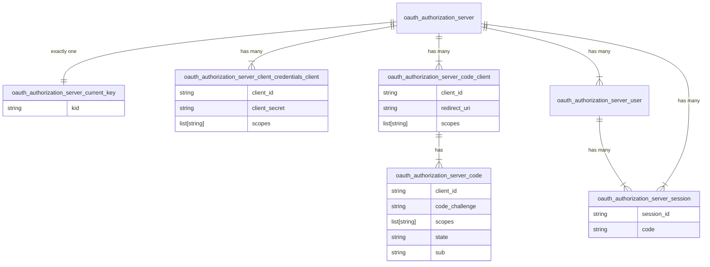
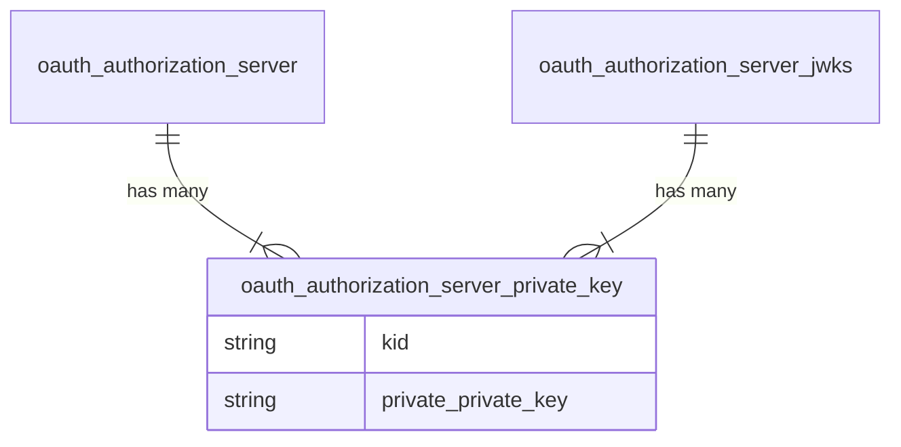
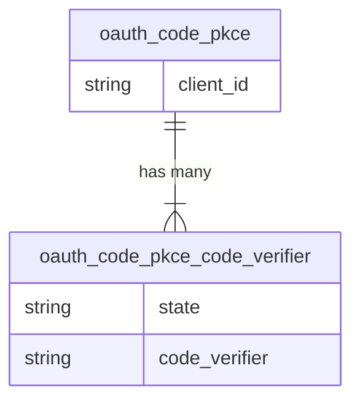
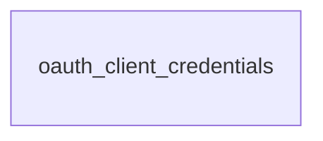
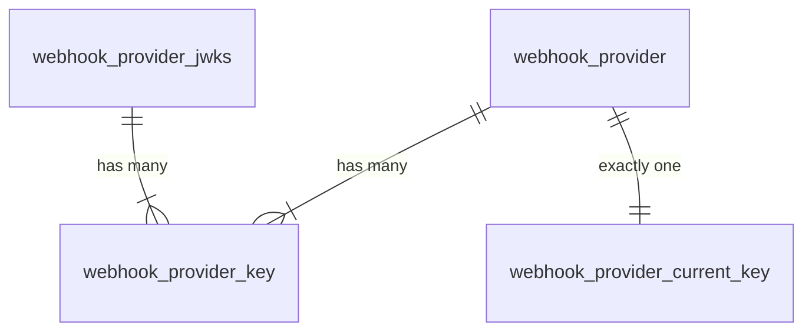
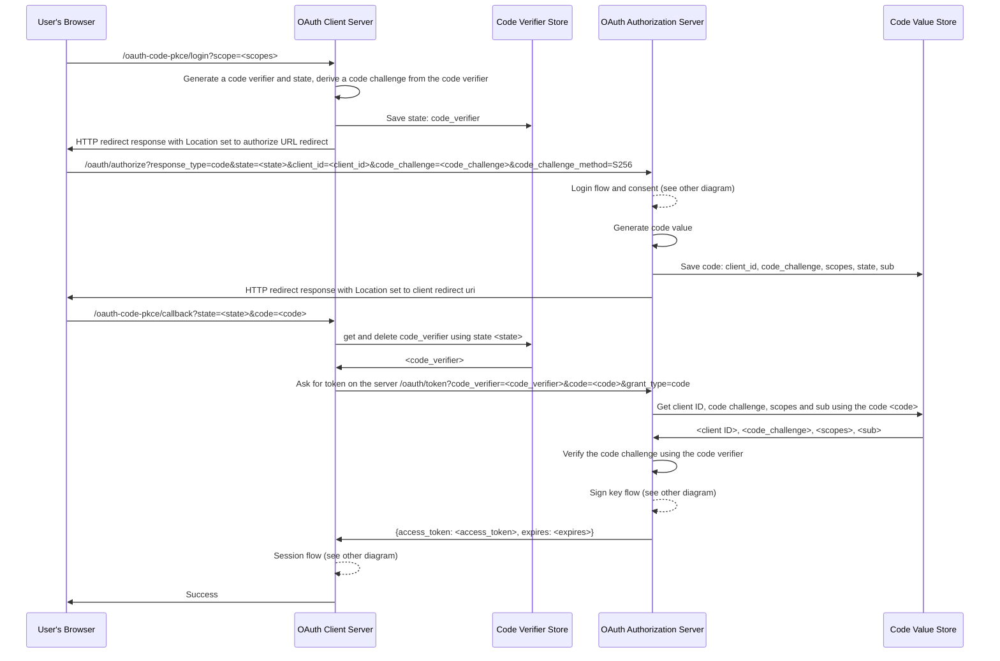
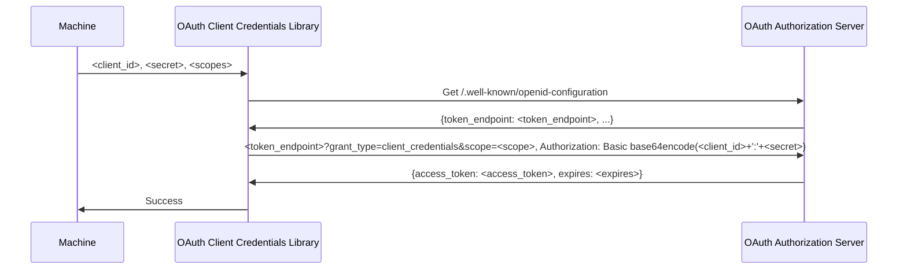
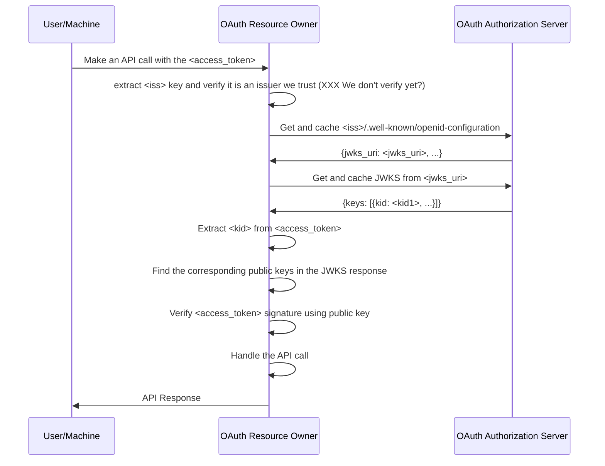
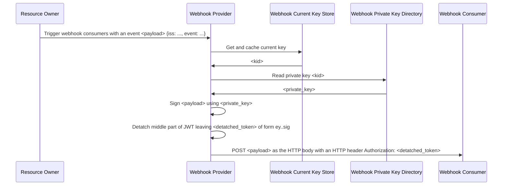
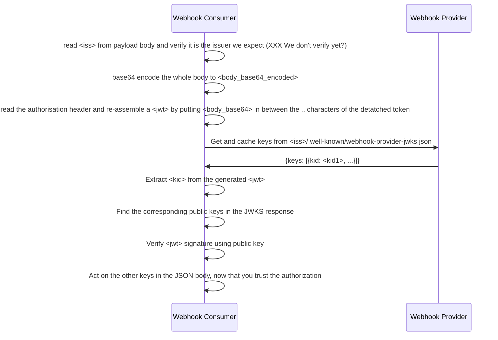

# Python Auth Tools

This is a work in progress set of OAuth and SAML 2 auth components that are ported from Go code I wrote years ago, that itself was based on even earlier Python code.

I now intend to use it to help in testing other components.

They probably aren't much use to you.

[AGPLv3](https://www.gnu.org/licenses/agpl-3.0.en.html)

## Terminology

See [https://www.oauth.com/oauth2-servers/definitions/](https://www.oauth.com/oauth2-servers/definitions/)

## NTP

You need to be running an NTP daemon (and may need to restart it if you see drift) otherwise the SAML flow might fail because the token is issued by the remote server before your computer's current time.

## Code Structure

I'd like this code to run in multiple very different environments like Raspberry Pi or AWS Lambda. So there are a few things that are a bit different:

* `.py` files are named according to the convention `componenttype_componentname_subcomponentname.py`. This means that all files of the same type (config, routes, stores, helpers, etc) are all close together which in turn means it is easy to copy patterns for each component type between components.
* Everything ends up with long names. But the upside of this is that is incredibly clear what each thing is, and refactoring is more straightforward because there are fewer name collisions
* There is no package. All the individual `.py` files should be on `PYTHONPATH` and can therefore just be imported, no need for `setup.py`, `pyproject.toml` or `pip` in order to use them
* There are no directories for `.py` files. By keeping everything top level, everything can import everything else easily without the code needing to be installed as a package.
* There aren't really any classes, they aren't needed. Instead each module is designed to be used once (singleton pattern) and so can store its state in module-level global variables. This means everything can be normal Python functions. The code does uses classes for data validation though. If you need to use the same component twice, make a copy of the files with a different name. The implementations will probably diverge over time anyway, so in the long term you'll reduce bugs.
* There is a hooks system so that you can customise the behaviour of the existing code without needing classes/inheritance etc.
* The code isn't threadsafe, instead it uses gevent for cooperative multitasking making it very efficient in a single process. You an safely run multiple processes at once on the same computer and round-robin proxy to each if you want to make the most of the available CPUs.
* All HTTP headers are lowercase. If you set or try to access anything not lowercase, it won't error, but the behaviour is undefined.

## Understanding Hooks

To run any of the code, you compose the different `.py` files together into your own `hooks_` Python module that imports the `helper_hooks` module and sets its `hooks` variable with all the hooks you want to register.

That `hooks_` module name is then passed to one of the `cli_*.py` files on the command line when you run it.

Behind the scenes, each of the modules that can use your hooks will do so by looking them up in `helper_hooks.hooks`.

The only example of this is the `app_test.py` file which is used to run a server that combines an OAuth 2 Authorization Server, Clients, Resource Owners as well as Login, consen (albeit automatically granted) and SAML2 flows as part of the test suite.


## Install


```sh
python3 -m venv .venv
source .venv/bin/activate
pip install -r requirements.txt
pip install -r requirements-dev.txt
```

The SAML functionality needs `xmlsec1`. You can get it on macOS with `brew install libxmlsec1`. On Debian bookworm, just install `python3-pysaml2` and it is a dependency.

## Config

Optional:

```sh
TMP_DIR='./tmp'
STORE_DIR='./store'
```

## Plugins

* init
* cleanup
* routes
* \*\*hooks

XXX More documentation needed here.

* app
* plugin
* hook

## Run

In the first terminal:

```sh
source .venv/bin/activate
```

```sh
python3 cli_oauth_authorization_server_client_credentials_put.py app_test client secret read
python3 cli_oauth_authorization_server_code_pkce_put.py app_test client http://localhost:16001/oauth-code-pkce/callback read
python3 cli_oauth_authorization_server_keys_generate.py app_test test
python3 cli_oauth_authorization_server_keys_current_set.py app_test test
```

```sh
python3 cli_serve_gevent.py app_test
```

In the second terminal:

```sh
source .venv/bin/activate
```

```sh
export TOKEN=`python3 cli_oauth_authorization_server_sign_jwt.py app_test client sub "read" test` && echo $TOKEN
python3 cli_oauth_resource_owner_verify_jwt.py app_test "$TOKEN"
curl -H "Authorization: Bearer $TOKEN" -v http://localhost:16001/api/v1
```

```sh
python3 cli_webhook_provider_keys_generate.py app_test test
python3 cli_webhook_provider_keys_current_set.py app_test test
export PAYLOAD='{"hello": "world"}'
export SIG=`python3 cli_webhook_provider_sign_jwt.py app_test "$PAYLOAD" test` && echo $SIG
python3 cli_webhook_consumer_verify_jwt.py app_test "$SIG" "$PAYLOAD" "http://localhost:16001/.well-known/webhook-provider-jwks.json"
```

```sh
python3 cli_oauth_client_credentials.py app_test client secret read
```

## Test

Install Chromium and Chromium Webdriver:

```sh
apt install -y chromium chromium-driver python3-selenium
```

Then run (deleting your existing stores):

```sh
sudo systemctl restart ntp
rm -rf ./store ./test ./tmp && python3 test.py
```

On macOS you'll need a new version of ChromeDriver. You can fetch it like this:

```sh
curl -O  https://edgedl.me.gvt1.com/edgedl/chrome/chrome-for-testing/116.0.5845.96/mac-arm64/chromedriver-mac-arm64.zip
unzip chromedriver-mac-arm64.zip
mv chromedriver-mac-arm64/chromedriver .
rm chromedriver-mac-arm64.zip
rm -r chromedriver-mac-arm64
```

Then you can run the tests with the path to the local `chromedriver` like this:

```sh
rm -rf ./store ./test ./tmp && PATH="$PWD:$PATH" python3 test.py
```

## Using this via a git submodule

```sh
git init
git submodule add https://github.com/thejimmyg/python-auth-tools
git add .gitmodules python-auth-tools
git commit -m 'Initialised project'
```

After cloning a repo with submodules, or if you want to update the submodule to the latest commit, run:

```sh
git submodule update
```

Or during development just symlink this project somewhere:

```sh
ln -s ../python-auth-tools python-auth-tools
```

Create you own plugin:

```sh
cat << EOF > my_app.py
from route_static import route_static

routes = {
    "/": route_static("python-auth-tools/static/file", "text/plain"),
}
EOF
```

Then you can use the files by adjusting your `PYTHONPATH`:

```sh
export PYTHONPATH="${PWD}:${PWD}/python-auth-tools:${PYTHONPATH}"
python3 python-auth-tools/cli_serve_gevent.py my_app
```

See [https://git-scm.com/book/en/v2/Git-Tools-Submodules](https://git-scm.com/book/en/v2/Git-Tools-Submodules) and [https://docs.python.org/3/using/cmdline.html#envvar-PYTHONPATH](https://docs.python.org/3/using/cmdline.html#envvar-PYTHONPATH)

## Contributions

Contributions must be public domain or licensed under the MIT license as well
as the AGPLv3, even though this code is AGPLv3. This allows for possible
re-licensing in future.

## Dev

```sh
isort . &&  autoflake -r --in-place --remove-unused-variables --remove-all-unused-imports . && black .
```

## Conceptual ERD


At the moment there is no physical store or management for the oauth_authorization_server_user, you simply enter their sub as part of the code + PKCE flow.

The database structure looks like this:



XXX Do we need oauth_authorization_server_code string state?

In addition the OAuth Authorizatioin Server uses the filesystem to store private keys and a `jwks.json` file:




When a Code + PKCE client redirects to the OAuth Authorizatioin Server authoire
endpoint, a code value is generated and stored, with the code itself being
added to the session. After the login, this means that the code value can be
retrieved from the session and sent to the client, where it can then call the
OAuth Authorizatioin Server token endpoint with the code to get the access
tokens.

XXX Why can't the session implementation be generic? At the moment it is specifically to cache the code that is requested (code verifier?)


The storage for a Code + PKCE client looks like this:



And for a client credentials client there isn't really any storage needed beacuase the client_id, secret, and requested scopes are all passed at the time of the flow:



The webhook provider structure is similar to the keys part of the OAuth Authorization Server:



## OAuth Code + PKCE Flow

This misses out scope checks too.



Is it OK to use the state as the key for the code verifier in the client server? I think it is.

The token exchange doesn't check the sub matches the login session. If you have obtained the code, you can exchange it.

## OAuth Client Credentials Flow

This misses out scope checks too.



## Resource Owner Flow





## Webhook Flow

Send an event to a webhook consumer:



The webhook consumer verifies the `<body>` it gets `POST`ed like this:



This flow is robust in the face of key rotation, and doesn't require a shared secret of any type.

## SAML SP Flow

```mermaid
sequenceDiagram
```
